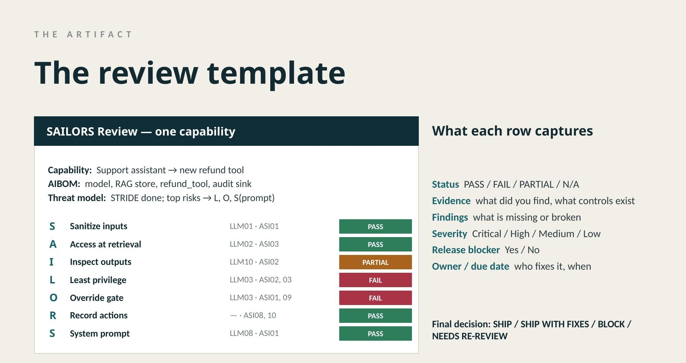

# SAILORS

**A feature-level security controls framework for individual AI capabilities.**

*A filled-in SAILORS review of one AI capability. The full write-up is in [`examples/refund-tool-review.md`](examples/refund-tool-review.md).*

---

SAILORS is seven checks you run on one AI feature before it ships. Threat modeling finds the risk. SAILORS verifies the controls that address it. A review takes about thirty minutes and ends with a written decision: ship, ship with fixes, or block.

If you own an AI feature and someone asked you what controls are in place before it ships, this repo is for you.

Start by opening [`templates/sailors-review-template.md`](templates/sailors-review-template.md) and running it against one of your capabilities.

---

## The framework

| Letter | Principle | What it checks |
|---|---|---|
| **S** | Sanitize all inputs | Are user and tool inputs validated, encoded, and bounded before reaching the model? |
| **A** | Access controls at retrieval | Does retrieval (RAG, tool calls, memory) respect the requesting user's actual permissions? If retrieval is another agent's output, this becomes a MAESTRO question. |
| **I** | Inspect and filter outputs | Is model output checked before it is rendered, executed, or passed downstream? |
| **L** | Least privilege for tools | Does the capability hold only the permissions it needs, nothing more? Includes resource-usage scope. |
| **O** | Override gate for humans (action + scope) | Is there a human checkpoint before (1) a consequential action fires, and (2) any expansion in the capability's scope or permissions during a session? |
| **R** | Record every action | Is there an audit trail sufficient to reconstruct what happened and why? If the agent writes its own log, route logs through a channel the capability cannot modify. |
| **S** | System prompt hardening | Is the system prompt resistant to injection, leakage, and override attempts? |

Seven checks. One capability. About thirty minutes.

---

## Where SAILORS fits

SAILORS sits between threat modeling and runtime enforcement.

| Layer | Question | Examples |
|---|---|---|
| Threat modeling | What can go wrong? | STRIDE, PASTA, MAESTRO |
| **Controls verification** | **What controls do we verify before shipping?** | **SAILORS** |
| Runtime enforcement | Are the controls actually working? | Belay, LLM Guard, NeMo Guardrails, HiddenLayer |

### What SAILORS is

SAILORS verifies what controls exist before one AI capability ships. It is a checklist and a review process.

### What SAILORS is not

- **Not a threat modeling framework.** Use STRIDE or MAESTRO to identify what can go wrong. SAILORS verifies the controls that address it.
- **Not runtime enforcement.** Use runtime tools (Belay, LLM Guard, NeMo Guardrails) for enforcement.
- **Not org governance.** Use NIST AI RMF or ISO 42001 for that.
- **Not exhaustive.** SAILORS is a curated set of controls, not a complete list. Cloud AI service configuration is a known gap.

### How to use it

1. Threat model the capability (STRIDE or MAESTRO) to identify what can go wrong.
2. Use the threat model to select the relevant SAILORS checks.
3. Open the [review template](templates/sailors-review-template.md).
4. Walk the relevant checks against the capability.
5. Flag gaps as findings. Prioritize by exploitability and blast radius.
6. Record the decision: ship, ship with fixes, or block.
7. Re-run at each significant AIBOM change. The [trigger matrix](docs/aibom-trigger.md) tells you which checks.

A filled-in review is in [`examples/refund-tool-review.md`](examples/refund-tool-review.md).

---

## Review template

The [review template](templates/sailors-review-template.md) is a fillable document for a thirty-minute design review. It has sections for:

- Capability information
- AIBOM snapshot: model, data sources, tools, output sinks, and what changed since the last review
- Threat assessment: which threats were identified, which checks were selected
- All seven checks with status (PASS / FAIL / PARTIAL / N/A), evidence, findings, severity, release-blocker flag
- Summary: top risks, required fixes, accepted risks, final decision
- Next review trigger

Print it. Take it to the design review. Fill it out.

---

## AIBOM trigger

SAILORS reviews are triggered by changes to your AI Bill of Materials, not by a calendar. The [AIBOM trigger document](docs/aibom-trigger.md) covers:

- Minimal AIBOM fields for one capability
- Trigger events that should start a SAILORS review
- A trigger matrix that maps each type of change to a subset of checks (not all seven every time)
- Three workflow options: manual, PR trigger, and CI/CD gate

AIBOM tells you what capabilities exist and what changed. SAILORS tells you what to review before the change ships.

---

## SAILORS-Verify: PoC scanner

SAILORS-Verify is a lightweight scanner that runs SAILORS's seven checks against real Python code.

- Covers 5 of 7 checks: S, A, L, O, R.
- Pattern matching. **Not full static analysis.**
- Does not yet cover I, S (system prompt hardening), or three sub-checks that need cross-file context.
- A starting point for a manual review, not a replacement for one.

The scanner, a test file, and example output are in [`poc/`](poc/).

---
# Worked Examples

Two examples of applying SAILORS to real capabilities. They cover different situations:

- [refund-capability-walkthrough.md](https://github.com/vinayavasu/SAILORS/blob/main/examples/refund-capability-walkthrough.md): prose walkthrough that teaches the thinking behind each of the seven checks. Best if you are learning what each check means in practice. About 15 minutes to read.
- [refund-tool-review.md](https://github.com/vinayavasu/SAILORS/blob/main/examples/refund-tool-review.md): a completed review triggered by an AIBOM change (new refund tool added to an existing assistant). Shows the trigger matrix picking a subset of checks and what the thirty-minute review actually produces. Best if you want to see the artifact you would hand to a release manager.

If you have run SAILORS on one of your own capabilities and want to contribute an anonymized write-up, see [CONTRIBUTING.md](https://github.com/vinayavasu/SAILORS/blob/main/CONTRIBUTING.md).

## Mapping to existing standards

SAILORS is cross-referenced against:

- OWASP Top 10 for LLM Applications (2026)
- OWASP Top 10 for Agentic Applications (2026)
- MITRE ATLAS tactics, where they apply at the capability level

The full mapping is in [`mapping.md`](mapping.md). The coverage matrix (what SAILORS covers directly, what it covers partially, and where companion controls fill the gap) is in [`docs/owasp-coverage-matrix.md`](docs/owasp-coverage-matrix.md).

Coverage summary: 6 direct, 2 partial, 2 companion on OWASP LLM Top 10. 4 direct, 4 partial, 2 companion on OWASP Agentic Top 10. Architecture-level and runtime risks (supply chain, data poisoning, unbounded consumption, inter-agent communication) are handled by companion controls rather than by stretching the seven checks.

---

## What comes after SAILORS

SAILORS covers the design review. Two frameworks go deeper once the capability is built and deployed:

- **RAISE** (Responsible AI Software Engineering): Steve Wilson's maturity model for how an agent is engineered, secured, tested, and operated across six categories.
- **Praxen**: an open-source agent behavior verifier. Reads code and deployment state, checks against a declared policy (Worker Remit), and produces a scored posture report with `file:line` evidence.

SAILORS asks the design-time questions. RAISE assesses engineering maturity. Praxen verifies that the controls are actually implemented after the code exists.

A comparison of SAILORS against Praxen and RAISE, using a deliberately broken demo agent called **FinBot**, is in [`praxen-comparison/`](praxen-comparison/).

---

## Known limitations

SAILORS is curated, not exhaustive. Not covered:

- Cloud AI service configuration (Azure OpenAI, AWS Bedrock input-protection settings)
- Whole-system architecture. Use STRIDE.
- Multi-agent trust boundaries. Use MAESTRO.
- Runtime monitoring and enforcement. Use Belay, LLM Guard, or NeMo Guardrails.
- Organizational AI governance. Use NIST AI RMF or ISO 42001.
- Adversarial ML model attacks. Use MITRE ATLAS.

Cloud AI service hardening is a known gap identified during expert review. A future version may add a cloud configuration check.

---

## Status

v1.1. Actively seeking practitioner feedback from teams shipping AI capabilities. Release history is in [CHANGELOG.md](CHANGELOG.md).

---

## Contributing
[
The most useful contribution right now is a real capability write-up. Anonymize the names. Keep the findings honest. Three concrete ways to help are in [CONTRIBUTING.md](](https://github.com/vinayavasu/SAILORS/blob/main/CONTRIBUTING.md).

Issues and pull requests welcome.

---

## Author

Vinaya Vasudevan. AI Security Engineer, CAISP, SANS AIS247 Portfolio.

- Website: [vinayavasu.github.io](https://vinayavasu.github.io)
- Writing: [Prompt to Patch](https://prompt-to-patch-vinaya.hashnode.dev/)
- LinkedIn: [vinayavasudevan](https://www.linkedin.com/in/vinaya-vasudevan/)

---

## License

MIT. See [LICENSE](LICENSE).
====================
